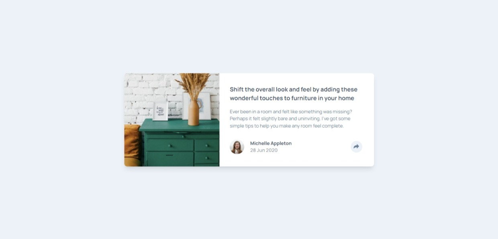
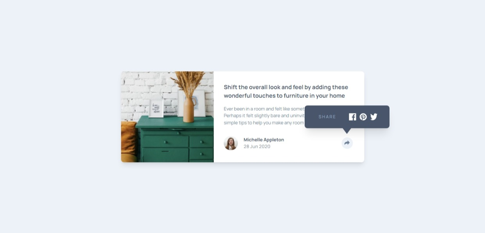
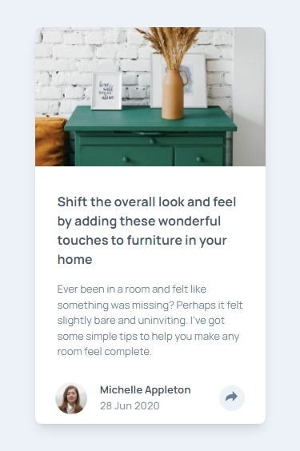
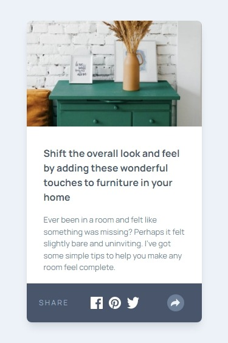

# Frontend Mentor - Article preview component solution

This is a solution to the [Article preview component challenge on Frontend Mentor](https://www.frontendmentor.io/challenges/article-preview-component-dYBN_pYFT). Frontend Mentor challenges help you improve your coding skills by building realistic projects. 

## Table of contents

- [Overview](#overview)
  - [The challenge](#the-challenge)
  - [Screenshot](#screenshot)
  - [Links](#links)
- [My process](#my-process)
  - [Built with](#built-with)
  - [What I learned](#what-i-learned)
  - [Continued development](#continued-development)
- [Author](#author)
- [Acknowledgments](#acknowledgments)

## Overview

### The challenge

Users should be able to:

- View the optimal layout for the component depending on their device's screen size
- See the social media share links when they click the share icon

### Screenshot

### Links

- Solution URL: [https://github.com/Thiagouh/article-preview-component-challenge](https://github.com/Thiagouh/article-preview-component-challenge)
- Live Site URL: [https://thiagouh.github.io/article-preview-component-challenge/](https://thiagouh.github.io/article-preview-component-challenge/)

## My process

### Built with

- Semantic HTML5 markup
- CSS custom properties
- Flexbox
- Mobile-first workflow
- [Tailwind CSS](https://tailwindcss.com/) - For styles

### What I learned

I learned how to use JS with the DOM, as well as how to work with responsiveness where the same content is behaved in different ways on different screens.

### Continued development

I intend to continue developing these skills.

## Author

- Frontend Mentor - [@Thiaoguh](https://www.frontendmentor.io/profile/Thiagouh)

## Acknowledgments

I appreciate in advance any feedback you provide me!
